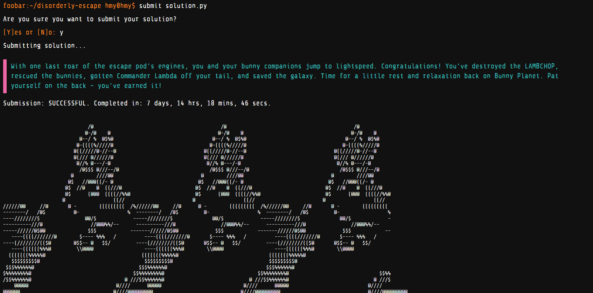
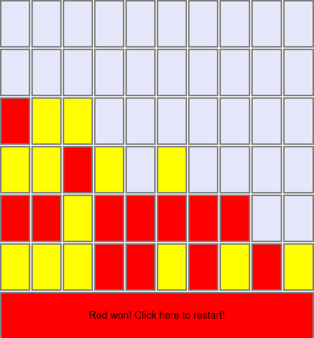

# :zap: Interview & Practice Questions  
  
:rocket: In this repo, I store a selection of the assignments and questions I came across in the **real interviews** and I solved on the online interview platforms such as **Google Foobar**. Also, my LeetCode profile is here: https://leetcode.com/hmy0hmy 
  
### :star2: Google Foobar Completed  
  
:rabbit: All rabbits are free!  
{ 'success' : 'great', 'colleague' : 'esteemed', 'efforts' : 'incredible', 'achievement' : 'unlocked', 'rabbits' : 'safe', 'foo' : 'win!' }
  
*Questions renamed and simplified. Explanations can be found in the code files.*  

  
  
### :star2: Building Connect Four with React  
  
The assignment was to build [Connect Four] game in React. In addition to [my submission](https://github.com/hm-y/connect-4-via-React), I've been asked to implement some other features in code review, such as:  
- How can we re-implement it for 3 players or bigger board?
- How can we add an undo feature?
- How to make it more efficient if played by high volume of people?  
 
